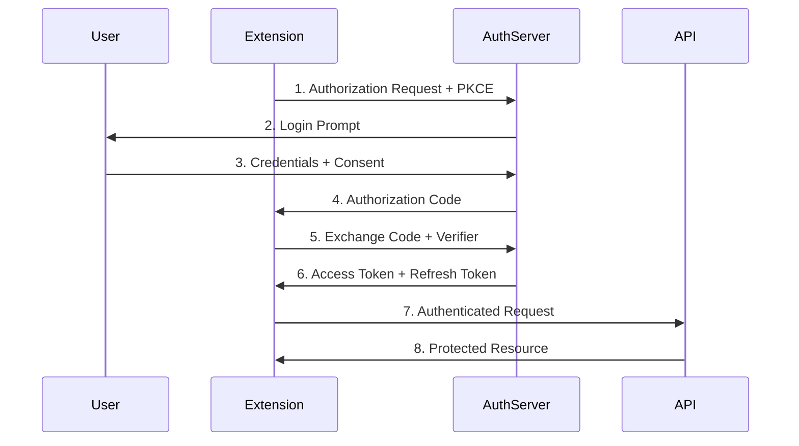

# Chrome Extension OAuth2 Authentication: Complete Implementation Guide

OAuth2 has become the de facto standard for securing API access in Chrome extensions. Whether you're building an extension that integrates with Google Drive, GitHub repositories, Twitter feeds, or a custom backend service, understanding OAuth2 implementation patterns is essential for creating secure, user-friendly authentication experiences. This guide covers everything from choosing the right OAuth2 flow to implementing PKCE, managing tokens securely, and handling the unique challenges that Manifest V3 introduces.

## Introduction {#introduction}

Modern Chrome extensions frequently need to access protected resources on behalf of users. Rather than asking users to share their passwords—a practice that poses significant security risks—OAuth2 provides a secure authorization framework that allows users to grant limited access to their resources without exposing credentials.

### Use Cases for OAuth2 in Extensions

OAuth2 authentication in Chrome extensions powers numerous scenarios:

- **Google APIs**: Accessing Google Drive files, Gmail messages, Calendar events, or YouTube data
- **GitHub Integration**: Reading/writing repositories, managing issues, accessing gists
- **Social Media**: Posting to Twitter, reading Facebook feeds, integrating with LinkedIn
- **Custom Backends**: Securing access to your own API services with user-specific tokens
- **Third-Party Services**: Stripe payments, Slack notifications, Trello boards, Discord webhooks

Each of these providers implements OAuth2 with slight variations, but the core patterns remain consistent. Extensions can leverage Chrome's built-in identity APIs to simplify the OAuth2 flow significantly.

### OAuth2 Flows Relevant to Extensions

Chrome extensions operate in a unique environment that affects which OAuth2 flows are appropriate. Unlike traditional web applications, extensions run in multiple contexts (background service worker, popup, content scripts) and cannot maintain a traditional server-side redirect endpoint. This eliminates some flows and requires adaptation of others.

The primary flows used in extensions are:

1. **Authorization Code Flow with PKCE** - The recommended approach for most providers
2. **Chrome Identity API (chrome.identity)** - Google's built-in solution for Google APIs
3. **Implicit Flow** - Deprecated and should not be used in new implementations

## OAuth2 Flows for Extensions {#oauth2-flows}

Understanding which OAuth2 flow to use is critical for security and user experience. Let's examine each option in detail.

### Authorization Code Flow (Recommended)

The Authorization Code Flow with PKCE (Proof Key for Code Exchange) represents the gold standard for extension authentication. This flow was originally designed for mobile apps but has become the recommended approach for all public clients, including browser extensions.



**Why PKCE Matters**: Without PKCE, a malicious actor could intercept the authorization code and exchange it for tokens. PKCE adds cryptographic verification that the client initiating the flow is the same client completing it.

### chrome.identity.launchWebAuthFlow (Non-Google Providers)

For non-Google OAuth2 providers, Chrome provides the `chrome.identity.launchWebAuthFlow` API. This method opens a browser popup where users authenticate with the third-party provider, then receives the result via a redirect:

```typescript
interface AuthOptions {
  url: string;
  interactive?: boolean;
}

chrome.identity.launchWebAuthFlow(
  { url: "https://provider.com/oauth/authorize?...", interactive: true },
  (redirectUrl) => {
    // Parse authorization code from redirectUrl
  }
);
```

The redirect URL must be registered with the OAuth provider and follow Chrome's extension redirect pattern: `https://<extension-id>.chromiumapp.org/`

### chrome.identity.getAuthToken (Google APIs Specifically)

Google provides a streamlined API specifically for Google OAuth2:

```typescript
chrome.identity.getAuthToken(
  { interactive: true, scopes: ["https://www.googleapis.com/auth/drive"] },
  (token) => {
    // Token immediately available
  }
);
```

This method handles token caching, refresh, and the entire OAuth flow internally. It's the preferred method when working with Google APIs.

### Why Implicit Flow Is Deprecated

The Implicit Flow was historically used because it avoided server-side code exchange. However, it has significant security vulnerabilities:

- Tokens appear in URL fragments, which can be logged in browser history and referrer headers
- No mechanism to refresh tokens securely
- Vulnerable to token interception attacks

Modern best practices require using Authorization Code Flow with PKCE for all new implementations. The OAuth 2.0 Security Best Current Practice document explicitly recommends this approach.

### Flow Comparison Table

| Flow | Use Case | Security | Complexity | Token Refresh |
|------|----------|----------|------------|---------------|
| Authorization Code + PKCE | Non-Google providers | High | Medium | Manual |
| chrome.identity.getAuthToken | Google APIs | High | Low | Automatic |
| chrome.identity.launchWebAuthFlow | Non-Google with custom UI | High | Medium | Manual |
| Implicit Flow | Legacy only | Low | Low | Not supported |

## Google OAuth2 with chrome.identity {#google-oauth2}

Google's identity API provides the smoothest integration for extensions accessing Google services. Let's walk through the complete setup.

### Setting Up Google Cloud Console

1. Navigate to [Google Cloud Console](https://console.cloud.google.com/)
2. Create a new project or select an existing one
3. Enable the APIs your extension needs (e.g., Google Drive API, Gmail API)
4. Go to **APIs & Services > OAuth consent screen**
5. Configure the consent screen:
   - User Type: **Internal** (for published extensions) or **External**
   - App name, logo, and support email
   - Authorized domains (if applicable)
6. Go to **Credentials > Create Credentials > OAuth client ID**
7. Select **Chrome App** as the application type
8. Enter your extension ID in the "Application ID" field

### Manifest Configuration

```json
{
  "name": "My Google Drive Extension",
  "version": "1.0.0",
  "oauth2": {
    "client_id": "your-client-id.apps.googleusercontent.com",
    "scopes": [
      "https://www.googleapis.com/auth/drive.readonly",
      "https://www.googleapis.com/auth/drive.file"
    ]
  },
  "permissions": [
    "identity",
    "storage",
    "https://www.googleapis.com/*"
  ]
}
```

### GoogleAuthService Implementation

```typescript
// services/GoogleAuthService.ts

interface TokenResponse {
  access_token: string;
  expires_in: number;
  scope: string;
  token_type: string;
}

interface AuthConfig {
  interactive: boolean;
}

export class GoogleAuthService {
  private static readonly TOKEN_KEY = 'google_access_token';
  private static readonly EXPIRY_KEY = 'google_token_expiry';

  constructor(private scopes: string[]) {}

  /**
   * Check if user is currently authenticated
   */
  async isAuthenticated(): Promise<boolean> {
    const token = await this.getStoredToken();
    if (!token) return false;
    
    const expiry = await this.getTokenExpiry();
    return expiry ? Date.now() < expiry : false;
  }

  /**
   * Get authentication token, prompting user if necessary
   */
  async login(config: AuthConfig = { interactive: true }): Promise<string | null> {
    return new Promise((resolve, reject) => {
      chrome.identity.getAuthToken(
        { 
          interactive: config.interactive,
          scopes: this.scopes 
        },
        (token) => {
          if (chrome.runtime.lastError) {
            reject(new Error(chrome.runtime.lastError.message));
            return;
          }
          
          if (token) {
            this.storeToken(token);
            resolve(token);
          } else {
            resolve(null);
          }
        }
      );
    });
  }

  /**
   * Get cached token or obtain new one silently
   */
  async getToken(): Promise<string | null> {
    const storedToken = await this.getStoredToken();
    const expiry = await this.getTokenExpiry();
    
    // Return cached token if still valid
    if (storedToken && expiry && Date.now() < expiry - 60000) {
      return storedToken;
    }
    
    // Try to get fresh token
    return this.login({ interactive: false });
  }

  /**
   * Remove cached token and revoke access
   */
  async logout(): Promise<void> {
    const token = await this.getStoredToken();
    
    if (token) {
      // Attempt to revoke token on Google's server
      try {
        await fetch(`https://oauth2.googleapis.com/revoke?token=${token}`);
      } catch (error) {
        console.warn('Failed to revoke token:', error);
      }
    }
    
    // Clear local storage
    await chrome.storage.local.remove([
      GoogleAuthService.TOKEN_KEY,
      GoogleAuthService.EXPIRY_KEY
    ]);
  }

  /**
   * Force token refresh by removing cached token and getting new one
   */
  async refreshToken(): Promise<string | null> {
    await chrome.identity.removeCachedAuthToken(
      { token: await this.getStoredToken() },
      () => {}
    );
    
    await chrome.storage.local.remove([GoogleAuthService.TOKEN_KEY]);
    return this.login({ interactive: false });
  }

  private async getStoredToken(): Promise<string | null> {
    const result = await chrome.storage.local.get(GoogleAuthService.TOKEN_KEY);
    return result[GoogleAuthService.TOKEN_KEY] || null;
  }

  private async storeToken(token: string): Promise<void> {
    // Store token with expiry (assuming 3600 seconds default)
    await chrome.storage.local.set({
      [GoogleAuthService.TOKEN_KEY]: token,
      [GoogleAuthService.EXPIRY_KEY]: Date.now() + 3600 * 1000
    });
  }

  private async getTokenExpiry(): Promise<number | null> {
    const result = await chrome.storage.local.get(GoogleAuthService.EXPIRY_KEY);
    return result[GoogleAuthService.EXPIRY_KEY] || null;
  }
}
```

### Handling Token Expiration

Token expiration handling is crucial for maintaining a good user experience. The Google identity API automatically caches tokens, but you should implement explicit expiration checking:

```typescript
// Add automatic refresh interceptor
async function makeAuthenticatedRequest(
  url: string, 
  authService: GoogleAuthService
): Promise<Response> {
  const token = await authService.getToken();
  
  const response = await fetch(url, {
    headers: {
      'Authorization': `Bearer ${token}`
    }
  });

  // Handle 401 - Unauthorized (token expired)
  if (response.status === 401) {
    const newToken = await authService.refreshToken();
    
    if (newToken) {
      // Retry request with new token
      return fetch(url, {
        headers: {
          'Authorization': `Bearer ${newToken}`
        }
      });
    }
  }

  return response;
}
```

## Non-Google OAuth2 with launchWebAuthFlow {#non-google-oauth2}

For providers other than Google, you must implement the full Authorization Code Flow with PKCE. This section covers the complete implementation.

### Building the Authorization URL

The authorization URL must include PKCE parameters:

```typescript
// services/OAuthClient.ts

interface OAuthConfig {
  clientId: string;
  authorizationEndpoint: string;
  tokenEndpoint: string;
  redirectUri: string;
  scopes: string[];
}

interface TokenResponse {
  access_token: string;
  refresh_token?: string;
  expires_in: number;
  token_type: string;
}

export class OAuthClient {
  private codeVerifier: string | null = null;

  constructor(
    private config: OAuthConfig,
    private storage: TokenStorage
  ) {}

  /**
   * Generate PKCE code verifier and challenge
   */
  private async generatePKCE(): Promise<{ verifier: string; challenge: string }> {
    // Generate random code verifier (43-128 characters)
    const verifier = this.generateRandomString(64);
    
    // Generate code challenge from verifier
    const encoder = new TextEncoder();
    const data = encoder.encode(verifier);
    const hash = await crypto.subtle.digest('SHA-256', data);
    const challenge = this.base64UrlEncode(new Uint8Array(hash));
    
    return { verifier, challenge };
  }

  /**
   * Build the authorization URL with PKCE
   */
  async buildAuthorizationUrl(): Promise<string> {
    const { verifier, challenge } = await this.generatePKCE();
    
    // Store verifier for later token exchange
    this.codeVerifier = verifier;
    await this.storage.set('pkce_verifier', verifier);

    const params = new URLSearchParams({
      client_id: this.config.clientId,
      redirect_uri: this.config.redirectUri,
      response_type: 'code',
      scope: this.config.scopes.join(' '),
      code_challenge: challenge,
      code_challenge_method: 'S256',
      state: this.generateRandomString(32)
    });

    return `${this.config.authorizationEndpoint}?${params.toString()}`;
  }

  /**
   * Launch the OAuth flow using Chrome's identity API
   */
  async authenticate(): Promise<TokenResponse | null> {
    const authUrl = await this.buildAuthorizationUrl();

    return new Promise((resolve, reject) => {
      chrome.identity.launchWebAuthFlow(
        { url: authUrl, interactive: true },
        async (redirectUrl) => {
          if (chrome.runtime.lastError) {
            reject(new Error(chrome.runtime.lastError.message));
            return;
          }

          if (!redirectUrl) {
            resolve(null);
            return;
          }

          try {
            const tokens = await this.exchangeCodeForTokens(redirectUrl);
            await this.storage.setTokens(tokens);
            resolve(tokens);
          } catch (error) {
            reject(error);
          }
        }
      );
    });
  }

  /**
   * Parse authorization code from redirect URL and exchange for tokens
   */
  private async exchangeCodeForTokens(redirectUrl: string): Promise<TokenResponse> {
    const url = new URL(redirectUrl);
    const code = url.searchParams.get('code');
    
    if (!code) {
      throw new Error('No authorization code in redirect');
    }

    // Retrieve PKCE verifier
    const verifier = await this.storage.get('pkce_verifier');
    if (!verifier) {
      throw new Error('PKCE verifier not found');
    }

    const response = await fetch(this.config.tokenEndpoint, {
      method: 'POST',
      headers: {
        'Content-Type': 'application/x-www-form-urlencoded'
      },
      body: new URLSearchParams({
        client_id: this.config.clientId,
        code: code,
        code_verifier: verifier,
        grant_type: 'authorization_code',
        redirect_uri: this.config.redirectUri
      })
    });

    if (!response.ok) {
      const error = await response.text();
      throw new Error(`Token exchange failed: ${error}`);
    }

    const tokens: TokenResponse = await response.json();
    
    // Clean up PKCE verifier
    await this.storage.remove('pkce_verifier');
    
    return tokens;
  }

  private generateRandomString(length: number): string {
    const array = new Uint8Array(length);
    crypto.getRandomValues(array);
    return Array.from(array, byte => 
      'ABCDEFGHIJKLMNOPQRSTUVWXYZabcdefghijklmnopqrstuvwxyz0123456789-._~'[byte % 64]
    ).join('');
  }

  private base64UrlEncode(buffer: Uint8Array): string {
    return btoa(String.fromCharCode(...buffer))
      .replace(/\+/g, '-')
      .replace(/\//g, '_')
      .replace(/=+$/, '');
  }
}
```

### Provider-Specific Configurations

Here are example configurations for popular OAuth2 providers:

```typescript
// GitHub
const githubConfig: OAuthConfig = {
  clientId: 'your-github-client-id',
  authorizationEndpoint: 'https://github.com/login/oauth/authorize',
  tokenEndpoint: 'https://github.com/login/oauth/access_token',
  redirectUri: 'https://<extension-id>.chromiumapp.org/github-callback',
  scopes: ['repo', 'user:email']
};

// Twitter (OAuth 2.0)
const twitterConfig: OAuthConfig = {
  clientId: 'your-twitter-client-id',
  authorizationEndpoint: 'https://twitter.com/i/oauth2/authorize',
  tokenEndpoint: 'https://api.twitter.com/2/oauth2/token',
  redirectUri: 'https://<extension-id>.chromiumapp.org/twitter-callback',
  scopes: ['tweet.read', 'users.read', 'offline.access']
};

// Discord
const discordConfig: OAuthConfig = {
  clientId: 'your-discord-client-id',
  authorizationEndpoint: 'https://discord.com/api/oauth2/authorize',
  tokenEndpoint: 'https://discord.com/api/oauth2/token',
  redirectUri: 'https://<extension-id>.chromiumapp.org/discord-callback',
  scopes: ['identify', 'guilds']
};
```

**Important**: Replace `<extension-id>` with your actual extension ID. You can find this in `chrome://extensions` with developer mode enabled.

## Token Management {#token-management}

Proper token management is crucial for security and user experience. Let's implement a robust token management system.

### Secure Token Storage

Manifest V3 provides `chrome.storage.session` for storing session tokens that are encrypted at rest:

```typescript
// services/TokenManager.ts

interface StoredTokens {
  accessToken: string;
  refreshToken?: string;
  expiresAt?: number;
  tokenType?: string;
}

export class TokenManager {
  private static readonly STORAGE_KEY = 'oauth_tokens';

  /**
   * Store tokens in session storage (MV3, encrypted at rest)
   */
  async storeTokens(tokens: StoredTokens): Promise<void> {
    const expiresAt = tokens.expiresAt || Date.now() + 3600 * 1000;
    
    await chrome.storage.session.set({
      [TokenManager.STORAGE_KEY]: {
        ...tokens,
        expiresAt
      }
    });
  }

  /**
   * Retrieve stored tokens
   */
  async getTokens(): Promise<StoredTokens | null> {
    const result = await chrome.storage.session.get(TokenManager.STORAGE_KEY);
    return result[TokenManager.STORAGE_KEY] || null;
  }

  /**
   * Get valid access token, refreshing if necessary
   */
  async getValidToken(refreshCallback: () => Promise<StoredTokens>): Promise<string | null> {
    const tokens = await this.getTokens();
    
    if (!tokens) {
      return null;
    }

    // Check if token is expired or about to expire
    if (tokens.expiresAt && Date.now() >= tokens.expiresAt - 60000) {
      if (tokens.refreshToken) {
        try {
          const newTokens = await refreshCallback();
          await this.storeTokens(newTokens);
          return newTokens.accessToken;
        } catch (error) {
          // Refresh failed, clear tokens
          await this.clearTokens();
          return null;
        }
      }
      
      // No refresh token available, clear expired tokens
      await this.clearTokens();
      return null;
    }

    return tokens.accessToken;
  }

  /**
   * Clear all stored tokens
   */
  async clearTokens(): Promise<void> {
    await chrome.storage.session.remove(TokenManager.STORAGE_KEY);
  }

  /**
   * Check if user is authenticated
   */
  async isAuthenticated(): Promise<boolean> {
    const tokens = await this.getTokens();
    return tokens !== null && !!tokens.accessToken;
  }
}
```

### Token Refresh with Retry and Backoff

Network errors during token refresh are common. Implement exponential backoff:

```typescript
// utils/tokenRefresh.ts

interface RefreshConfig {
  maxRetries: number;
  initialDelayMs: number;
  maxDelayMs: number;
}

export async function refreshTokenWithRetry(
  refreshFn: () => Promise<TokenResponse>,
  config: RefreshConfig = { maxRetries: 3, initialDelayMs: 1000, maxDelayMs: 10000 }
): Promise<TokenResponse> {
  let lastError: Error | null = null;
  
  for (let attempt = 0; attempt < config.maxRetries; attempt++) {
    try {
      return await refreshFn();
    } catch (error) {
      lastError = error as Error;
      
      // Don't retry on certain errors
      if (error instanceof OAuthError) {
        if (error.code === 'invalid_grant' || error.code === 'invalid_client') {
          throw error; // Don't retry authentication failures
        }
      }
      
      // Calculate delay with exponential backoff
      const delay = Math.min(
        config.initialDelayMs * Math.pow(2, attempt),
        config.maxDelayMs
      );
      
      console.log(`Token refresh failed, retrying in ${delay}ms...`);
      await new Promise(resolve => setTimeout(resolve, delay));
    }
  }
  
  throw lastError || new Error('Token refresh failed after max retries');
}

export class OAuthError extends Error {
  constructor(
    public code: string,
    message: string
  ) {
    super(message);
    this.name = 'OAuthError';
  }
}
```

### Auto-Logout on Token Revocation

Handle scenarios where the provider invalidates tokens:

```typescript
// Handle token revocation detection
async function setupTokenRevocationListener(
  authService: GoogleAuthService,
  onLogout: () => void
): Promise<void> {
  // Poll periodically to check token validity
  setInterval(async () => {
    try {
      const isValid = await authService.isAuthenticated();
      if (!isValid) {
        await authService.logout();
        onLogout();
      }
    } catch (error) {
      console.error('Token validation failed:', error);
    }
  }, 60000); // Check every minute
}
```

## PKCE Implementation {#pkce-implementation}

PKCE (Proof Key for Code Exchange) is mandatory for public clients and significantly enhances security.

### Understanding PKCE

PKCE adds three parameters to the OAuth2 flow:

1. **code_verifier**: A cryptographically random string (43-128 characters)
2. **code_challenge**: A SHA-256 hash of the verifier, base64url-encoded
3. **code_challenge_method**: 'S256' (recommended) or 'plain' (less secure)

The authorization server stores the challenge and verifies it during token exchange by hashing the provided verifier.

### Complete PKCE Implementation

```typescript
// utils/pkce.ts

/**
 * Generate a cryptographically secure code verifier
 * Per RFC 7636: 43-128 characters from [A-Z] / [a-z] / [0-9] / "-" / "." / "_" / "~"
 */
export async function generateCodeVerifier(): Promise<string> {
  const array = new Uint8Array(32);
  crypto.getRandomValues(array);
  
  // Base64url encode without padding
  const verifier = base64UrlEncode(array);
  
  // Ensure minimum length (43 characters for 256-bit security)
  return verifier + base64UrlEncode(crypto.getRandomValues(new Uint8Array(21)));
}

/**
 * Generate code challenge from verifier using S256 method
 */
export async function generateCodeChallenge(verifier: string): Promise<string> {
  const encoder = new TextEncoder();
  const data = encoder.encode(verifier);
  const hash = await crypto.subtle.digest('SHA-256', data);
  return base64UrlEncode(new Uint8Array(hash));
}

/**
 * Verify that the code verifier matches the challenge
 * (Server-side only, shown for understanding)
 */
export async function verifyCodeChallenge(
  verifier: string,
  expectedChallenge: string
): Promise<boolean> {
  const actualChallenge = await generateCodeChallenge(verifier);
  return actualChallenge === expectedChallenge;
}

/**
 * Base64url encoding helper (RFC 4648)
 */
function base64UrlEncode(buffer: Uint8Array): string {
  const base64 = btoa(String.fromCharCode(...buffer));
  return base64
    .replace(/\+/g, '-')
    .replace(/\//g, '_')
    .replace(/=+$/, '');
}

/**
 * Full PKCE flow for extensions
 */
export class PKCEFlow {
  private static readonly VERIFIER_KEY = 'pkce_verifier';
  
  /**
   * Initiate PKCE flow - generate and store verifier, return auth URL
   */
  static async initiate(authUrl: string): Promise<string> {
    const verifier = await generateCodeVerifier();
    const challenge = await generateCodeChallenge(verifier);
    
    // Store verifier for later use
    await chrome.storage.session.set({ 
      [PKCEFlow.VERIFIER_KEY]: verifier 
    });
    
    // Add PKCE parameters to authorization URL
    const url = new URL(authUrl);
    url.searchParams.set('code_challenge', challenge);
    url.searchParams.set('code_challenge_method', 'S256');
    
    return url.toString();
  }
  
  /**
   * Complete PKCE flow - retrieve verifier for token exchange
   */
  static async complete(): Promise<string | null> {
    const result = await chrome.storage.session.get(PKCEFlow.VERIFIER_KEY);
    const verifier = result[PKCEFlow.VERIFIER_KEY];
    
    // Clear verifier after use (one-time)
    await chrome.storage.session.remove(PKCEFlow.VERIFIER_KEY);
    
    return verifier || null;
  }
}
```

## Manifest V3 Considerations {#mv3-considerations}

Manifest V3 introduced significant changes that affect OAuth2 implementation.

### Service Worker Lifecycle

Service workers in MV3 are ephemeral—they terminate after a period of inactivity and restart on events. This has implications for token management:

```typescript
// Always retrieve tokens from storage in event handlers, never from memory
chrome.runtime.onMessage.addListener((message, sender, sendResponse) => {
  if (message.type === 'GET_AUTH_TOKEN') {
    // Must read from storage each time
    tokenManager.getValidToken(refreshToken).then(token => {
      sendResponse({ token });
    });
    return true; // Indicates async response
  }
});
```

### Session Storage for Tokens

Use `chrome.storage.session` for sensitive tokens in MV3:

```typescript
// Preferred: session storage (encrypted at rest in MV3)
await chrome.storage.session.set({ 
  token: encryptedToken 
});

// Fallback: local storage (requires manual encryption)
await chrome.storage.local.set({
  token: encrypt(token, encryptionKey)
});
```

### Offscreen Documents for Long-Running Operations

For operations that require persistent context, use offscreen documents:

```typescript
// Create offscreen document for token refresh
async function createTokenRefreshContext(): Promise<void> {
  const existingContexts = await chrome.offscreen.getContexts();
  
  if (existingContexts.length === 0) {
    await chrome.offscreen.createDocument({
      url: 'offscreen.html',
      reasons: ['TOKEN_REFRESH' as chrome.offscreen.Reason],
      justification: 'Refresh OAuth tokens without interrupting service worker'
    });
  }
}
```

### Content Security Policy Implications

MV3 enforces stricter CSP. Ensure your OAuth flow complies:

```json
{
  "content_security_policy": {
    "extension_pages": "script-src 'self'; object-src 'self'; connect-src https://*.google.com https://*.github.com https://api.twitter.com"
  }
}
```

## Error Handling and Edge Cases {#error-handling}

Robust error handling ensures a smooth user experience even when things go wrong.

### Common OAuth2 Errors

```typescript
// types/OAuthErrors.ts

export enum OAuthErrorCode {
  USER_DENIED = 'access_denied',
  INVALID_REQUEST = 'invalid_request',
  UNAUTHORIZED_CLIENT = 'unauthorized_client',
  INVALID_GRANT = 'invalid_grant',
  UNSUPPORTED_GRANT_TYPE = 'unsupported_grant_type',
  INVALID_SCOPE = 'invalid_scope',
  SERVER_ERROR = 'server_error',
  TEMPORARILY_UNAVAILABLE = 'temporarily_unavailable'
}

export function handleOAuthError(error: unknown): string {
  if (error instanceof Response) {
    return `HTTP ${error.status}: ${error.statusText}`;
  }
  
  if (error instanceof Error) {
    // Check for specific error patterns
    if (error.message.includes('User denied')) {
      return 'Permission denied. Please grant access to continue.';
    }
    
    if (error.message.includes('network') || error.message.includes('fetch')) {
      return 'Network error. Please check your connection.';
    }
    
    return error.message;
  }
  
  return 'An unknown error occurred';
}

export async function withErrorHandling<T>(
  operation: () => Promise<T>,
  onError: (error: string) => void
): Promise<T | null> {
  try {
    return await operation();
  } catch (error) {
    const message = handleOAuthError(error);
    onError(message);
    return null;
  }
}
```

### Handling Specific Edge Cases

```typescript
// Handle various edge cases
export class OAuthEdgeCaseHandler {
  /**
   * Handle user denying permission
   */
  static async handleUserDenial(): Promise<void> {
    // Clear any partial state
    await chrome.storage.session.clear();
    
    // Notify user clearly
    console.info('User denied OAuth permission');
  }

  /**
   * Handle token expiration during offline use
   */
  static async handleOfflineExpiration(
    cachedData: CachedData,
    refreshToken: string
  ): Promise<CachedData | null> {
    // Attempt refresh with cached refresh token
    try {
      const newTokens = await refreshAccessToken(refreshToken);
      return {
        ...cachedData,
        ...newTokens,
        cachedAt: Date.now()
      };
    } catch {
      // Refresh failed, must re-authenticate
      return null;
    }
  }

  /**
   * Handle provider rate limiting
   */
  static async handleRateLimit(
    retryAfter?: number
  ): Promise<void> {
    const delay = retryAfter || 5000; // Default 5 seconds
    await new Promise(resolve => setTimeout(resolve, delay));
  }

  /**
   * Handle extension update invalidating tokens
   */
  static async handleExtensionUpdate(): Promise<void> {
    // Extension ID changes on update in some cases
    // Re-authenticate if redirect URIs no longer match
    const tokens = await chrome.storage.session.get('oauth_tokens');
    if (tokens.oauth_tokens) {
      // Validate token still works
      const isValid = await validateToken(tokens.oauth_tokens.accessToken);
      if (!isValid) {
        await chrome.storage.session.remove('oauth_tokens');
      }
    }
  }
}
```

## Security Best Practices {#security-best-practices}

Follow these security guidelines to protect your users and implementation.

### Essential Security Checklist

```typescript
// security-checklist.ts

export const securityChecklist = {
  // Always use PKCE
  usePKCE: true,
  
  // Never store tokens in content scripts
  noContentScriptStorage: true,
  
  // Validate token scopes before API calls
  validateScopes: true,
  
  // Implement token rotation
  rotateTokens: true,
  
  // Use CSP headers
  configureCSP: true
};

/**
 * Example: Scope validation before API call
 */
async function validateScope(
  token: string,
  requiredScope: string,
  userInfoEndpoint: string
): Promise<boolean> {
  const response = await fetch(userInfoEndpoint, {
    headers: { 'Authorization': `Bearer ${token}` }
  });
  
  if (!response.ok) {
    return false;
  }
  
  const userInfo = await response.json();
  const scopes = userInfo.scope?.split(' ') || [];
  return scopes.includes(requiredScope);
}
```

### CSP Configuration

Configure Content Security Policy to prevent token leakage:

```json
{
  "content_security_policy": {
    "extension_pages": "script-src 'self'; style-src 'self' 'unsafe-inline'; img-src 'self' data: https:; connect-src https://*.google.com https://api.github.com https://api.twitter.com https://discord.com"
  }
}
```

### Token Rotation

Implement automatic token rotation for enhanced security:

```typescript
// services/TokenRotation.ts

export class TokenRotation {
  private static readonly ROTATION_THRESHOLD = 0.8; // Rotate at 80% of lifetime

  /**
   * Check if token should be rotated
   */
  static shouldRotate(expiresAt: number): boolean {
    const lifetimeRemaining = expiresAt - Date.now();
    const totalLifetime = 3600 * 1000; // Assume 1 hour
    const percentRemaining = lifetimeRemaining / totalLifetime;
    
    return percentRemaining < TokenRotation.ROTATION_THRESHOLD;
  }

  /**
   * Proactively rotate token before expiration
   */
  static async rotateIfNeeded(
    tokenManager: TokenManager,
    refreshFn: () => Promise<TokenResponse>
  ): Promise<string | null> {
    const tokens = await tokenManager.getTokens();
    
    if (!tokens?.expiresAt) {
      return null;
    }

    if (TokenRotation.shouldRotate(tokens.expiresAt)) {
      console.info('Proactively rotating token');
      const newTokens = await refreshFn();
      await tokenManager.storeTokens(newTokens);
      return newTokens.accessToken;
    }

    return tokens.accessToken;
  }
}
```

## Complete Example: GitHub Integration {#github-example}

This section provides a complete, working GitHub OAuth2 integration demonstrating all the concepts covered.

### Manifest Configuration

```json
{
  "manifest_version": 3,
  "name": "GitHub Repository Manager",
  "version": "1.0.0",
  "description": "Manage your GitHub repositories with ease",
  "permissions": [
    "storage",
    "activeTab",
    "scripting"
  ],
  "host_permissions": [
    "https://api.github.com/*"
  ],
  "action": {
    "default_popup": "popup.html",
    "default_icon": {
      "16": "icons/icon16.png",
      "48": "icons/icon48.png",
      "128": "icons/icon128.png"
    }
  },
  "background": {
    "service_worker": "background.js",
    "type": "module"
  },
  "icons": {
    "16": "icons/icon16.png",
    "48": "icons/icon48.png",
    "128": "icons/icon128.png"
  }
}
```

### Background Script

```typescript
// background.ts

import { OAuthClient, OAuthConfig } from './services/OAuthClient';
import { TokenManager } from './services/TokenManager';

// GitHub OAuth configuration
const githubConfig: OAuthConfig = {
  clientId: 'your-github-client-id',
  authorizationEndpoint: 'https://github.com/login/oauth/authorize',
  tokenEndpoint: 'https://github.com/login/oauth/access_token',
  redirectUri: 'https://YOUR-EXTENSION-ID.chromiumapp.org/github-callback',
  scopes: ['repo', 'user:email', 'read:user']
};

// Initialize services
const tokenManager = new TokenManager();
const oauthClient = new OAuthClient(githubConfig, {
  async set(key: string, value: string): Promise<void> {
    await chrome.storage.session.set({ [key]: value });
  },
  async get(key: string): Promise<string | null> {
    const result = await chrome.storage.session.get(key);
    return result[key] || null;
  },
  async remove(key: string): Promise<void> {
    await chrome.storage.session.remove(key);
  }
});

// Message handler for popup communication
chrome.runtime.onMessage.addListener((message, sender, sendResponse) => {
  switch (message.type) {
    case 'AUTHENTICATE':
      handleAuthentication().then(sendResponse);
      return true;
      
    case 'LOGOUT':
      handleLogout().then(sendResponse);
      return true;
      
    case 'GET_USER':
      handleGetUser().then(sendResponse);
      return true;
      
    case 'GET_REPOS':
      handleGetRepositories(message.page).then(sendResponse);
      return true;
  }
});

async function handleAuthentication(): Promise<AuthResult> {
  try {
    const tokens = await oauthClient.authenticate();
    
    if (!tokens) {
      return { success: false, error: 'Authentication cancelled' };
    }
    
    // Store tokens
    await tokenManager.storeTokens({
      accessToken: tokens.access_token,
      refreshToken: tokens.refresh_token,
      expiresAt: Date.now() + (tokens.expires_in * 1000),
      tokenType: tokens.token_type
    });
    
    return { success: true };
  } catch (error) {
    return { 
      success: false, 
      error: error instanceof Error ? error.message : 'Authentication failed' 
    };
  }
}

async function handleLogout(): Promise<void> {
  await tokenManager.clearTokens();
}

async function handleGetUser(): Promise<GitHubUser | null> {
  const token = await tokenManager.getValidToken(() => refreshToken());
  
  if (!token) {
    return null;
  }
  
  const response = await fetch('https://api.github.com/user', {
    headers: {
      'Authorization': `Bearer ${token}`,
      'Accept': 'application/vnd.github.v3+json'
    }
  });
  
  if (!response.ok) {
    return null;
  }
  
  return response.json();
}

async function handleGetRepositories(page: number = 1): Promise<GitHubRepository[]> {
  const token = await tokenManager.getValidToken(() => refreshToken());
  
  if (!token) {
    throw new Error('Not authenticated');
  }
  
  const response = await fetch(
    `https://api.github.com/user/repos?page=${page}&per_page=10&sort=updated`,
    {
      headers: {
        'Authorization': `Bearer ${token}`,
        'Accept': 'application/vnd.github.v3+json'
      }
    }
  );
  
  if (!response.ok) {
    throw new Error('Failed to fetch repositories');
  }
  
  return response.json();
}

async function refreshToken(): Promise<TokenResponse> {
  const tokens = await tokenManager.getTokens();
  
  if (!tokens?.refreshToken) {
    throw new Error('No refresh token available');
  }
  
  const response = await fetch(githubConfig.tokenEndpoint, {
    method: 'POST',
    headers: {
      'Content-Type': 'application/x-www-form-urlencoded'
    },
    body: new URLSearchParams({
      client_id: githubConfig.clientId,
      grant_type: 'refresh_token',
      refresh_token: tokens.refreshToken
    })
  });
  
  if (!response.ok) {
    throw new Error('Token refresh failed');
  }
  
  return response.json();
}

interface AuthResult {
  success: boolean;
  error?: string;
}

interface GitHubUser {
  login: string;
  id: number;
  avatar_url: string;
  name: string;
  email: string;
}

interface GitHubRepository {
  id: number;
  name: string;
  full_name: string;
  description: string;
  html_url: string;
  stargazers_count: number;
  updated_at: string;
}

interface TokenResponse {
  access_token: string;
  refresh_token?: string;
  expires_in: number;
  token_type: string;
}
```

### Popup UI

```html
<!-- popup.html -->
<!DOCTYPE html>
<html>
<head>
  <style>
    * { box-sizing: border-box; margin: 0; padding: 0; }
    body { width: 320px; padding: 16px; font-family: -apple-system, BlinkMacSystemFont, 'Segoe UI', Roboto, sans-serif; }
    
    .authenticated { display: none; }
    .unauthenticated { display: block; }
    .authenticated.show { display: block; }
    .unauthenticated.hide { display: none; }
    
    .user-info { display: flex; align-items: center; gap: 12px; margin-bottom: 16px; }
    .avatar { width: 48px; height: 48px; border-radius: 50%; }
    .user-details h3 { font-size: 14px; margin-bottom: 2px; }
    .user-details p { font-size: 12px; color: #666; }
    
    .btn {
      width: 100%;
      padding: 10px;
      border: none;
      border-radius: 6px;
      cursor: pointer;
      font-size: 14px;
      font-weight: 500;
    }
    .btn-primary { background: #238636; color: white; }
    .btn-primary:hover { background: #2ea043; }
    .btn-danger { background: #da3633; color: white; margin-top: 8px; }
    
    .repo-list { margin-top: 16px; border-top: 1px solid #eee; padding-top: 16px; }
    .repo-item { padding: 8px 0; border-bottom: 1px solid #eee; }
    .repo-item:last-child { border-bottom: none; }
    .repo-name { font-weight: 600; font-size: 13px; color: #0366d6; }
    .repo-meta { font-size: 11px; color: #666; margin-top: 4px; }
    
    .loading { text-align: center; padding: 20px; color: #666; }
  </style>
</head>
<body>
  <div id="unauthenticated" class="unauthenticated">
    <h2 style="margin-bottom: 16px; font-size: 16px;">GitHub Repositories</h2>
    <p style="margin-bottom: 16px; font-size: 13px; color: #666;">
      Connect your GitHub account to manage your repositories.
    </p>
    <button id="loginBtn" class="btn btn-primary">Connect GitHub</button>
  </div>
  
  <div id="authenticated" class="authenticated">
    <div class="user-info">
      
      <div class="user-details">
        <h3 id="userName">Loading...</h3>
        <p id="userEmail">Loading...</p>
      </div>
    </div>
    <button id="logoutBtn" class="btn btn-danger">Disconnect</button>
    
    <div class="repo-list">
      <h4 style="margin-bottom: 12px; font-size: 13px;">Recent Repositories</h4>
      <div id="repoList">
        <div class="loading">Loading repositories...</div>
      </div>
    </div>
  </div>
  
  <script src="popup.js"></script>
</body>
</html>
```

```typescript
// popup.ts

document.addEventListener('DOMContentLoaded', async () => {
  const unauthenticatedEl = document.getElementById('unauthenticated')!;
  const authenticatedEl = document.getElementById('authenticated')!;
  const loginBtn = document.getElementById('loginBtn')!;
  const logoutBtn = document.getElementById('logoutBtn')!;
  const avatarEl = document.getElementById('avatar') as HTMLImageElement;
  const userNameEl = document.getElementById('userName')!;
  const userEmailEl = document.getElementById('userEmail')!;
  const repoListEl = document.getElementById('repoList')!;
  
  // Check authentication state
  async function checkAuth() {
    const response = await chrome.runtime.sendMessage({ type: 'GET_USER' });
    
    if (response) {
      unauthenticatedEl.classList.add('hide');
      authenticatedEl.classList.add('show');
      avatarEl.src = response.avatar_url;
      userNameEl.textContent = response.name || response.login;
      userEmailEl.textContent = response.email || response.login;
      
      loadRepositories();
    } else {
      unauthenticatedEl.classList.remove('hide');
      authenticatedEl.classList.remove('show');
    }
  }
  
  async function loadRepositories() {
    try {
      const repos = await chrome.runtime.sendMessage({ type: 'GET_REPOS' });
      
      if (repos && repos.length > 0) {
        repoListEl.innerHTML = repos.map(repo => `
          <div class="repo-item">
            <a href="${repo.html_url}" target="_blank" class="repo-name">${repo.name}</a>
            <div class="repo-meta">⭐ ${repo.stargazers_count} • Updated ${new Date(repo.updated_at).toLocaleDateString()}</div>
          </div>
        `).join('');
      } else {
        repoListEl.innerHTML = '<p style="color: #666; font-size: 12px;">No repositories found</p>';
      }
    } catch (error) {
      repoListEl.innerHTML = '<p style="color: #d73a49; font-size: 12px;">Failed to load repositories</p>';
    }
  }
  
  loginBtn.addEventListener('click', async () => {
    const result = await chrome.runtime.sendMessage({ type: 'AUTHENTICATE' });
    
    if (result.success) {
      checkAuth();
    } else if (result.error) {
      alert(result.error);
    }
  });
  
  logoutBtn.addEventListener('click', async () => {
    await chrome.runtime.sendMessage({ type: 'LOGOUT' });
    checkAuth();
  });
  
  // Initialize
  checkAuth();
});
```

### GitHub API Calls

```typescript
// Example: Making authenticated API calls to GitHub

async function fetchAuthenticated<T>(
  endpoint: string,
  token: string,
  options: RequestInit = {}
): Promise<T> {
  const response = await fetch(`https://api.github.com${endpoint}`, {
    ...options,
    headers: {
      'Authorization': `Bearer ${token}`,
      'Accept': 'application/vnd.github.v3+json',
      ...options.headers
    }
  });
  
  if (!response.ok) {
    const error = await response.json();
    throw new Error(error.message || `GitHub API error: ${response.status}`);
  }
  
  return response.json();
}

// Example: Create a new issue
async function createIssue(
  token: string,
  owner: string,
  repo: string,
  title: string,
  body: string
): Promise<GitHubIssue> {
  return fetchAuthenticated<GitHubIssue>(
    `/repos/${owner}/${repo}/issues`,
    token,
    {
      method: 'POST',
      body: JSON.stringify({ title, body })
    }
  );
}

// Example: List user's gists
async function listGists(token: string, page: number = 1): Promise<GitHubGist[]> {
  return fetchAuthenticated<GitHubGist[]>(
    `/gists?page=${page}&per_page=10`,
    token
  );
}
```

## Conclusion

OAuth2 authentication in Chrome extensions requires careful implementation to balance security, user experience, and compatibility with Manifest V3's constraints. The key takeaways are:

1. **Always use PKCE** - It's required for public clients and significantly improves security
2. **Use chrome.identity for Google APIs** - It handles token management automatically
3. **Implement proper token storage** - Use `chrome.storage.session` in MV3 for encrypted session tokens
4. **Handle errors gracefully** - Network issues, token expiration, and user denial are all common scenarios
5. **Plan for MV3 service worker lifecycle** - Never rely on in-memory state for authentication

For monetization contexts where OAuth2 is essential, such as integrating with payment providers or syncing premium user data, following these patterns ensures your extension remains secure and reliable.

For more information on the Chrome identity API, see the [official Chrome extension identity documentation](https://developer.chrome.com/docs/extensions/mv3/identity).

---

Built by [Zovo](https://zovo.one) - Open-source tools and guides for extension developers.
