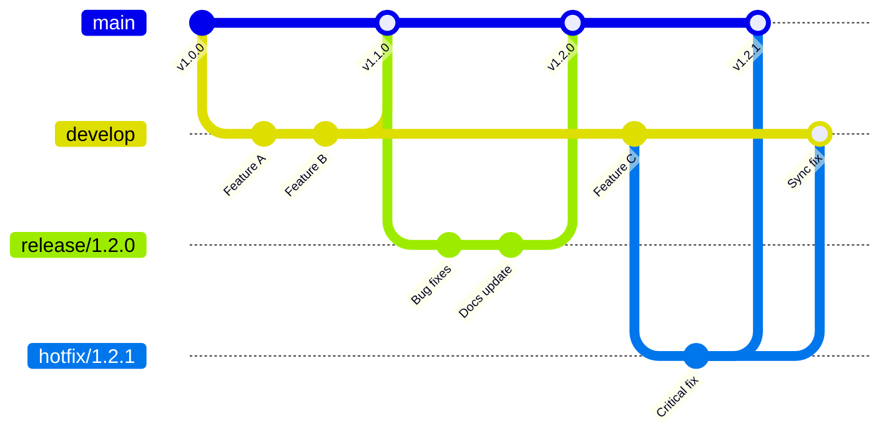

# Chrome Extension Release Management

Release management for Chrome extensions requires careful planning and execution. Unlike traditional web applications where you can deploy instant fixes, extensions live on users' machines and must go through the Chrome Web Store (CWS) review process. This guide covers the complete release lifecycle from versioning strategy to hotfixes and migration planning.

## Introduction: Why Release Management Matters More for Extensions

Chrome extensions present unique release management challenges that differ significantly from traditional web applications. When you deploy a web app, you control the servers and can roll back changes instantly if something goes wrong. Extensions don't offer this luxury—once a user has your extension installed, it lives in their browser until they manually update or remove it.

The Chrome Web Store review process adds another layer of complexity. While review times typically range from a few hours to a few days, they can occasionally take longer for complex extensions or during peak submission periods. This means your release pipeline must account for unpredictable delays, and you can't rely on instant patches to fix production issues.

Users notice breaking changes immediately in extensions because they run on every page load and interact with their browsing experience directly. A broken extension feels like a broken browser, and negative reviews accumulate quickly. This makes staged rollouts and thorough testing essential before any public release.

Good release management also impacts your extension's discoverability and credibility in the Chrome Web Store. Regular updates signal an active project, while well-documented changes help users understand what they're getting. For monetized extensions, reliable release processes directly impact revenue stability—users who have negative update experiences are likely to request refunds or abandon your extension altogether.

## Versioning Strategy

Choosing the right versioning strategy ensures consistent releases and helps users understand the scope of changes between versions. Chrome extensions support two versioning approaches that you should understand before deciding which to use.

### Semantic Versioning Adapted for Extensions

Semantic versioning (semver) follows the MAJOR.MINOR.PATCH format, where each segment conveys specific information about the scope of changes. This approach works well for extensions that have clear boundaries between feature additions, backwards-compatible improvements, and bug fixes.

For extensions, interpret the version numbers as follows: MAJOR increments when you make breaking changes that require users to adapt their workflows or when you remove existing features. MINOR increments when you add new features in a backwards-compatible manner. PATCH increments for backwards-compatible bug fixes and small improvements.

When transitioning from Manifest V2 to Manifest V3, you should increment the MAJOR version since this represents a significant architectural change that may affect how your extension functions.

### Chrome's Four-Part Version Format

Chrome's official documentation recommends a four-part version format: MAJOR.MINOR.BUILD.PATCH. This provides more granular control and aligns better with how Chrome interprets version numbers for update purposes.

```typescript
// utils/version.ts - Version management utility for Chrome extensions
import * as fs from 'fs';
import * as path from 'path';

interface VersionParts {
  major: number;
  minor: number;
  build: number;
  patch: number;
}

interface Manifest {
  version: string;
  version_name?: string;
}

export class VersionManager {
  private manifestPath: string;
  private packageJsonPath: string;

  constructor(manifestPath: string, packageJsonPath: string) {
    this.manifestPath = manifestPath;
    this.packageJsonPath = packageJsonPath;
  }

  parseVersion(versionString: string): VersionParts {
    const parts = versionString.split('.').map(Number);
    return {
      major: parts[0] || 0,
      minor: parts[1] || 0,
      build: parts[2] || 0,
      patch: parts[3] || 0
    };
  }

  formatVersion(parts: VersionParts): string {
    return `${parts.major}.${parts.minor}.${parts.build}.${parts.patch}`;
  }

  bumpVersion(currentVersion: string, type: 'major' | 'minor' | 'build' | 'patch'): string {
    const parts = this.parseVersion(currentVersion);
    
    switch (type) {
      case 'major':
        parts.major += 1;
        parts.minor = 0;
        parts.build = 0;
        parts.patch = 0;
        break;
      case 'minor':
        parts.minor += 1;
        parts.build = 0;
        parts.patch = 0;
        break;
      case 'build':
        parts.build += 1;
        parts.patch = 0;
        break;
      case 'patch':
        parts.patch += 1;
        break;
    }
    
    return this.formatVersion(parts);
  }

  updateManifestVersion(newVersion: string, versionName?: string): void {
    const manifest: Manifest = JSON.parse(fs.readFileSync(this.manifestPath, 'utf-8'));
    manifest.version = newVersion;
    
    if (versionName) {
      manifest.version_name = versionName;
    } else {
      // Auto-generate version name for display
      const parts = this.parseVersion(newVersion);
      const suffixes = ['', 'Beta', 'Alpha', 'Dev'];
      manifest.version_name = `${parts.major}.${parts.minor}.${parts.build} ${suffixes[parts.patch % 4]}`;
    }
    
    fs.writeFileSync(this.manifestPath, JSON.stringify(manifest, null, 2) + '\n');
  }

  updatePackageJson(newVersion: string): void {
    const packageJson = JSON.parse(fs.readFileSync(this.packageJsonPath, 'utf-8'));
    packageJson.version = newVersion;
    fs.writeFileSync(this.packageJsonPath, JSON.stringify(packageJson, null, 2) + '\n');
  }

  syncVersions(type: 'major' | 'minor' | 'build' | 'patch', versionName?: string): string {
    const packageJson = JSON.parse(fs.readFileSync(this.packageJsonPath, 'utf-8'));
    const currentVersion = packageJson.version;
    const newVersion = this.bumpVersion(currentVersion, type);
    
    this.updateManifestVersion(newVersion, versionName);
    this.updatePackageJson(newVersion);
    
    console.log(`Version bumped: ${currentVersion} -> ${newVersion}`);
    return newVersion;
  }
}

// Usage example:
// const versionManager = new VersionManager(
//   path.join(__dirname, 'manifest.json'),
//   path.join(__dirname, 'package.json')
// );
// versionManager.syncVersions('minor'); // Bump minor version and sync
```

### Version Comparison: Semver vs Chrome Four-Part

| Aspect | Semantic Versioning (MAJOR.MINOR.PATCH) | Chrome Four-Part (MAJOR.MINOR.BUILD.PATCH) |
|--------|------------------------------------------|---------------------------------------------|
| Update frequency | Best for monthly+ release cycles | Supports weekly or faster releases |
| Chrome compatibility | Works but less granular | Native Chrome interpretation |
| User understanding | Familiar to developers | Can be confusing without version_name |
| Flexibility | Less room for incremental versions | More room for rapid iteration |
| Recommended for | Stable, mature extensions | Active development with frequent updates |

Use the `version_name` field in your manifest to provide user-friendly version labels that clarify the nature of each release regardless of which versioning system you choose.

## Release Branching

A clear branching strategy keeps your development organized and prevents accidental releases. The following workflow separates stable releases from work-in-progress features.

### Branch Structure



Your main branch should always contain the latest stable release that users can access. The develop branch holds work scheduled for the next release. Release branches are created when you're preparing a specific version, allowing for bug fixes and documentation updates without interfering with ongoing development. Hotfix branches address critical issues that can't wait for the normal release cycle.

### Branch Naming Conventions

Use consistent branch naming to make your workflow clear to all contributors. Prefix feature branches with `feature/` or `feat/`, followed by a short description. Release branches follow the pattern `release/x.y.z`. Emergency fixes use `hotfix/` followed by the version being fixed.

Never commit directly to main or develop—always use pull requests with code review. This ensures at least one other person has examined your changes before they become part of a release.

## Changelog Management

Keeping users informed about what changed in each release builds trust and helps them decide whether to update. A well-maintained changelog also reduces support requests since users can find answers about new features or changes on their own.

### CHANGELOG.md Format

Follow the Keep a Changelog standard to maintain consistency. Your changelog should have distinct sections for Added, Changed, Deprecated, Removed, Fixed, and Security changes. Each release should have a clear date and version number.

```markdown
# Changelog

All notable changes to this extension will be documented in this file.

## [2.1.0] - 2024-01-15

### Added
- New dark mode toggle in settings
- Export data to CSV format
- Keyboard shortcut for quick actions (Ctrl+Shift+E)

### Changed
- Improved page load performance by 40%
- Updated all dependencies to latest versions
- Redesigned the popup interface for better usability

### Fixed
- Fixed memory leak in background service worker
- Resolved conflict with other extensions using storage API
- Corrected text truncation in long feed items

### Security
- Patched XSS vulnerability in user content rendering
- Updated Content Security Policy headers
```

### Auto-Generating Changelog from Conventional Commits

Configure your CI pipeline to generate changelogs automatically using conventional commit messages. Tools like standard-version or semantic-release can parse commit messages formatted as `feat:`, `fix:`, `docs:`, and other conventional types to build your changelog automatically.

### In-Extension "What's New" Popup

Show users what's new when your extension updates. The `chrome.runtime.onInstalled` event fires when a new version is installed, making it the perfect place to display changelog information.

```typescript
// background/changelog.ts - Handle extension updates and show changelog
import { showChangelog } from '../utils/changelog-ui';

chrome.runtime.onInstalled.addListener(async (details) => {
  if (details.reason === 'update') {
    const previousVersion = details.previousVersion;
    const currentVersion = chrome.runtime.getManifest().version;
    
    // Fetch changelog entries since last version
    const changelogEntries = await getChangelogSince(previousVersion);
    
    if (changelogEntries.length > 0) {
      // Store changelog for the popup to display
      await chrome.storage.local.set({
        pendingChangelog: {
          version: currentVersion,
          entries: changelogEntries,
          showAtNextOpen: true
        }
      });
      
      // Optionally show a notification
      chrome.notifications.create({
        type: 'basic',
        iconUrl: 'icons/icon-128.png',
        title: 'Extension Updated!',
        message: `Version ${currentVersion} is now available. Tap to see what's new.`
      });
    }
  } else if (details.reason === 'install') {
    // Show onboarding for new users
    await chrome.storage.local.set({
      showOnboarding: true
    });
  }
});

async function getChangelogSince(version: string): Promise<ChangelogEntry[]> {
  // This would typically fetch from your changelog or a remote config
  // For now, we'll return a subset based on known version changes
  const changelog = await fetch('/changelog.json').then(r => r.json());
  const versions = Object.keys(changelog).sort();
  const startIndex = versions.indexOf(version) + 1;
  
  if (startIndex === 0) return [];
  
  const entries: ChangelogEntry[] = [];
  for (let i = startIndex; i < versions.length; i++) {
    entries.push(...changelog[versions[i]]);
  }
  
  return entries;
}
```

```typescript
// utils/changelog-ui.ts - Display changelog in extension popup
import type { ChangelogEntry } from '../types/changelog';

export async function showChangelog(): Promise<void> {
  const { pendingChangelog } = await chrome.storage.local.get('pendingChangelog');
  
  if (!pendingChangelog?.showAtNextOpen) return;
  
  // Clear the flag so we don't show again
  await chrome.storage.local.set({
    pendingChangelog: { ...pendingChangelog, showAtNextOpen: false }
  });
  
  // Create and show the changelog panel
  const panel = document.getElementById('changelog-panel');
  if (panel) {
    renderChangelog(panel, pendingChangelog.entries);
    panel.classList.remove('hidden');
  }
}

function renderChangelog(container: HTMLElement, entries: ChangelogEntry[]): void {
  const html = `
    <div class="changelog">
      <h3>What's New in ${entries[0]?.version || 'Latest'}</h3>
      ${entries.map(entry => `
        <div class="changelog-entry">
          <span class="badge badge-${entry.type}">${entry.type}</span>
          <span class="message">${entry.message}</span>
        </div>
      `).join('')}
      <button id="changelog-dismiss" class="btn-primary">Got it!</button>
    </div>
  `;
  
  container.innerHTML = html;
  
  document.getElementById('changelog-dismiss')?.addEventListener('click', () => {
    container.classList.add('hidden');
  });
}
```

## CWS Review Process

Understanding the Chrome Web Store review process helps you submit cleaner packages and receive faster approvals. The review team looks for policy compliance, proper permission usage, and good user experience.

### Typical Review Times and Common Rejection Reasons

Most submissions review within 1-3 business days, though complex extensions or those requiring additional permissions may take longer. During holiday periods or after Chrome developer policy changes, expect delays.

Common rejection reasons include: excessive or unjustified permissions, misleading functionality that differs from the store listing, poor user experience or frequent errors, security issues like exposed API keys, and violations of Chrome Web Store policies regarding spam, deceptive behavior, or prohibited content.

### Permissions Justification

Every permission you request requires clear justification in the Chrome Web Store developer dashboard. Explain why each permission is necessary for your extension's core functionality. Request permissions incrementally—add new permissions only when needed for new features, and explain the specific use case for each.

Avoid requesting host permissions for `*://*/*` unless absolutely necessary. Instead, limit permissions to specific domains or use the activeTab permission which only grants access when the user explicitly invokes your extension.

### Responding to Reviewer Feedback

If your submission is rejected, you'll receive an email with specific feedback. Respond professionally and directly to each point raised. If you believe the rejection was incorrect, provide clear evidence supporting your position. For complex technical questions, consider scheduling a video call with the review team through the developer dashboard.

## Staged Rollouts

Staged rollouts let you catch issues before they affect your entire user base. Chrome Web Store supports deploying to percentages of users gradually, which is essential for extensions with large install bases.

### Recommended Rollout Schedule

Start with 5% of users and monitor metrics closely for at least 24-48 hours. If metrics remain healthy, expand to 25%, then 50%, and finally 100%. Each stage should last longer for more critical releases—a security fix might move quickly through stages, while a UI redesign warrants extended monitoring at each percentage.

### Monitoring Metrics Between Stages

Track these metrics at each stage: error rate in your crash reporting, user ratings and reviews, support ticket volume, feature usage analytics, and storage error rates. Create automated alerts that halt the rollout if error rates exceed your threshold.

### When to Halt a Rollout

Stop the rollout immediately if you see: error rates increasing by more than 10%, user ratings dropping significantly, critical functionality breaking, or support requests spike. Have a communication plan ready for users affected by the problematic release.

## Beta Testing

Beta testing catches issues that your internal testing can't find. Leverage both Chrome Web Store's built-in options and external distribution methods.

### CWS Beta Channel

Create a separate listing in the Chrome Web Store for beta testing. Use the "trusted testers" group feature to limit distribution to specific users who opt in. This gives you a controlled group to validate changes before broad release.

### Self-Hosted Beta Distribution

For faster iteration, distribute beta builds directly to testers via your website or a private link. This bypasses CWS review for each beta but requires testers to enable developer mode in Chrome.

```typescript
// utils/feature-flags.ts - Beta feature flag system for A/B testing
interface FeatureFlag {
  key: string;
  enabled: boolean;
  rolloutPercentage: number;
 betaUsers: string[];
  variants: Record<string, number>;
}

export class BetaFeatureFlags {
  private flags: Map<string, FeatureFlag> = new Map();
  private userId: string;

  constructor(userId: string) {
    this.userId = userId;
    this.loadFlags();
  }

  private async loadFlags(): Promise<void> {
    // In production, fetch from remote config
    const stored = await chrome.storage.local.get('featureFlags');
    if (stored.featureFlags) {
      this.flags = new Map(Object.entries(stored.featureFlags));
    }
  }

  isEnabled(flagKey: string): boolean {
    const flag = this.flags.get(flagKey);
    if (!flag) return false;
    
    // Beta users always get the feature
    if (flag.betaUsers.includes(this.userId)) {
      return true;
    }
    
    // Roll out to percentage of users
    if (flag.enabled) {
      const hash = this.hashUser(flagKey);
      return hash < flag.rolloutPercentage;
    }
    
    return false;
  }

  getVariant(flagKey: string, defaultVariant: string = 'control'): string {
    const flag = this.flags.get(flagKey);
    if (!flag || !flag.variants) return defaultVariant;
    
    const hash = this.hashUser(flagKey);
    const total = Object.values(flag.variants).reduce((a, b) => a + b, 0);
    let cumulative = 0;
    
    for (const [variant, percentage] of Object.entries(flag.variants)) {
      cumulative += (percentage / total) * 100;
      if (hash < cumulative) return variant;
    }
    
    return defaultVariant;
  }

  private hashUser(flagKey: string): number {
    const input = `${this.userId}-${flagKey}`;
    let hash = 0;
    for (let i = 0; i < input.length; i++) {
      const char = input.charCodeAt(i);
      hash = ((hash << 5) - hash) + char;
      hash = hash & hash;
    }
    return Math.abs(hash) % 100;
  }

  async setFlag(flag: FeatureFlag): Promise<void> {
    this.flags.set(flag.key, flag);
    await chrome.storage.local.set({
      featureFlags: Object.fromEntries(this.flags)
    });
  }
}

// Usage in your extension:
// const flags = new BetaFeatureFlags(await getUserId());
// if (flags.isEnabled('new-dashboard')) {
//   showNewDashboard();
// } else {
//   showLegacyDashboard();
// }
// 
// const variant = flags.getVariant('checkout-flow', 'control');
// loadCheckoutVariant(variant);
```

## Hotfix Process

When critical issues affect your users, you need a fast, reliable hotfix process. Hotfixes bypass normal development cycles to address urgent problems.

### Step-by-Step Hotfix Workflow

First, identify and confirm the critical issue through monitoring or user reports. Create a hotfix branch from the current stable release tag: `git checkout -b hotfix/1.2.1 v1.2.0`. Make the minimal fix needed to resolve the issue. Run your test suite to verify the fix doesn't break anything else. Submit to CWS with a clear explanation that this is a hotfix.

### Emergency CWS Submission

Mark your submission as urgent in the CWS dashboard if available, or reach out to Chrome developer support for critical issues. Include clear documentation of the bug and how your fix addresses it.

### User Communication Plan

Have template communications ready: a status page update, social media posts explaining the issue and timeline, and in-extension notifications for users once the fix is available. Be transparent about what happened and what you're doing to prevent recurrence.

### Post-Mortem Process

After the hotfix stabilizes, conduct a post-mortem to understand root cause and prevent similar issues. Document what went wrong, why it wasn't caught in testing, and what process changes would catch it earlier. Share relevant findings with your team.

## Migration Planning

Breaking changes require careful migration handling to prevent data loss and maintain user trust.

### Data Migration Between Versions

When you change your storage schema, users upgrading will lose their existing data unless you migrate it. Plan migrations as explicit steps in your update flow.

```typescript
// utils/migration-manager.ts - Handle storage schema upgrades
interface Migration {
  fromVersion: string;
  toVersion: string;
  migrate: (oldData: Record<string, unknown>) => Promise<Record<string, unknown>>;
}

class MigrationManager {
  private migrations: Migration[] = [];
  private currentVersion: string;

  constructor(currentVersion: string) {
    this.currentVersion = currentVersion;
  }

  registerMigration(migration: Migration): void {
    this.migrations.push(migration);
  }

  async migrateIfNeeded(): Promise<void> {
    const { schemaVersion, ...existingData } = await chrome.storage.local.get('schemaVersion');
    const storedVersion = schemaVersion || '1.0.0';
    
    if (storedVersion === this.currentVersion) {
      return; // Already at current version
    }

    // Sort migrations to apply in order
    const pendingMigrations = this.migrations
      .filter(m => this.compareVersions(m.fromVersion, storedVersion) >= 0)
      .sort((a, b) => this.compareVersions(a.fromVersion, b.fromVersion));

    let data = existingData;
    for (const migration of pendingMigrations) {
      console.log(`Migrating from ${migration.fromVersion} to ${migration.toVersion}`);
      data = await migration.migrate(data);
    }

    // Save migrated data with new version
    await chrome.storage.local.set({
      ...data,
      schemaVersion: this.currentVersion
    });
  }

  private compareVersions(a: string, b: string): number {
    const partsA = a.split('.').map(Number);
    const partsB = b.split('.').map(Number);
    for (let i = 0; i < Math.max(partsA.length, partsB.length); i++) {
      const partA = partsA[i] || 0;
      const partB = partsB[i] || 0;
      if (partA > partB) return 1;
      if (partB > partA) return -1;
    }
    return 0;
  }
}

// Example migrations
const migrationManager = new MigrationManager('2.0.0');

migrationManager.registerMigration({
  fromVersion: '1.0.0',
  toVersion: '1.1.0',
  migrate: async (data) => {
    // Migrate from v1.0.0 format to v1.1.0
    return {
      ...data,
      settings: {
        ...data.settings,
        theme: data.settings?.colorMode || 'light' // New field
      }
    };
  }
});

migrationManager.registerMigration({
  fromVersion: '1.1.0',
  toVersion: '2.0.0',
  migrate: async (data) => {
    // Major migration: restructure storage
    return {
      user: {
        preferences: data.settings,
        cache: data.cache
      },
      v2Format: true
    };
  }
});

// Run migration on extension update
chrome.runtime.onInstalled.addListener(async () => {
  await migrationManager.migrateIfNeeded();
});
```

### Backwards Compatibility Strategies

Maintain backwards compatibility when possible. Add new fields rather than changing existing ones, support multiple storage schemas simultaneously during transitions, and use feature detection rather than version checks. When breaking changes are necessary, support both old and new formats during a transition period.

### Deprecation Timeline for Removed Features

When removing features, provide advance notice: announce deprecation at least one major version before removal, include deprecation warnings in your extension UI, document migration paths for users, and consider maintaining minimal support for deprecated features during the transition.

## Release Checklist

Use this checklist for every release to ensure nothing is missed:

- [ ] All tests passing in CI
- [ ] Changelog updated with all changes since last release
- [ ] Version bumped in manifest.json and package.json
- [ ] Screenshots updated (if UI changed)
- [ ] CWS description updated (if features changed)
- [ ] Permissions justification reviewed
- [ ] Beta testing completed (for major releases)
- [ ] Git tag created for release
- [ ] CWS submission made
- [ ] Staged rollout configured (5% -> 25% -> 50% -> 100%)
- [ ] Monitor for 24 hours after reaching 100% rollout

## Automating Releases

For details on setting up automated build and deployment pipelines, see our [CI/CD Pipeline Guide](/guides/ci-cd-pipeline/). This covers GitHub Actions workflows, automated testing, and integration with the Chrome Web Store API for programmatic publishing.

For information on CWS-specific considerations including developer account setup and store listing optimization, refer to our [Extension Monetization Guide](/guides/extension-monetization/).

---

Built by [Zovo](https://zovo.one) - Open-source tools and guides for extension developers.
